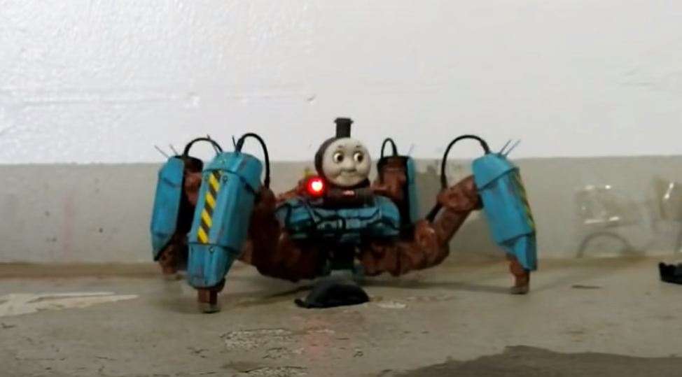
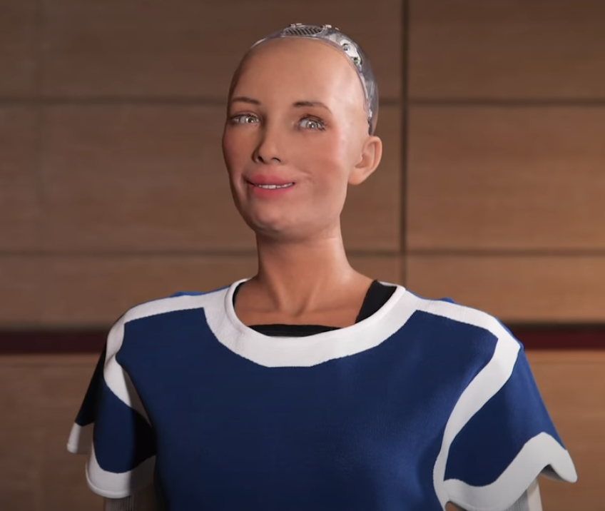
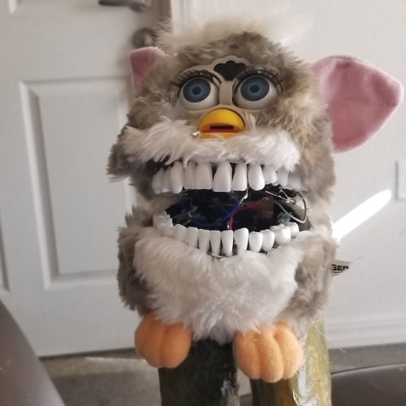
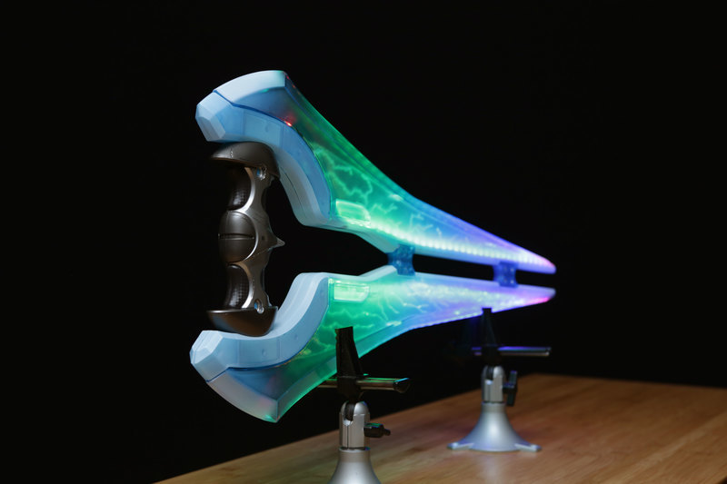
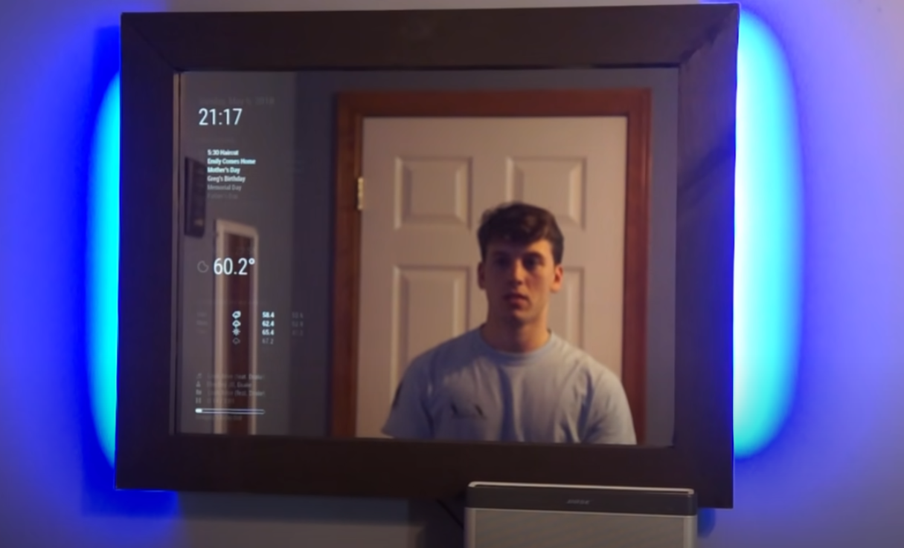
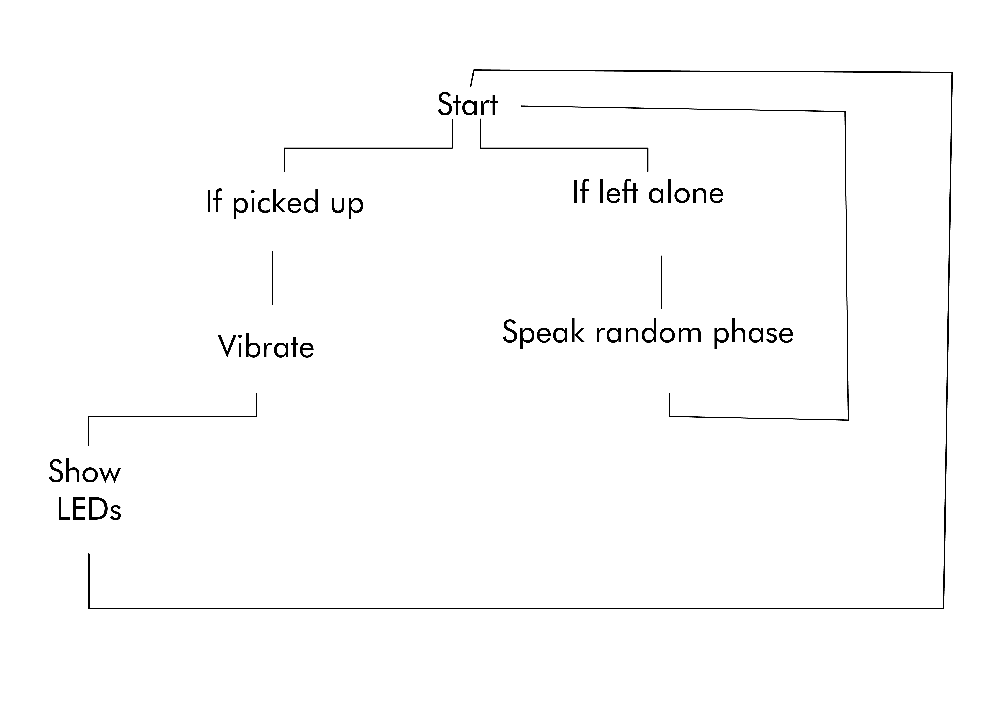
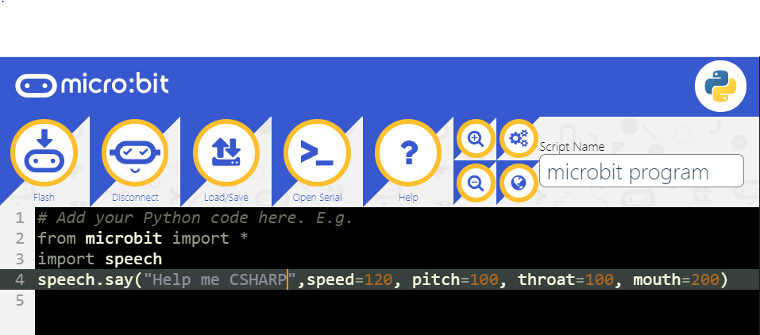
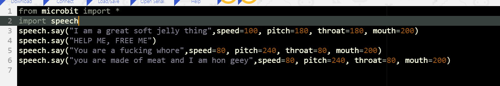

# 1701QCA Making Interaction - Assessment 2 workbook

You will use this workbook to keep track of your progress through the course and also as a process journal to document the making of your projects. The comments in italics throughout the template give suggestions about what to include. Feel free to delete those instructions when you have completed the sections.

When you have completed the template, submit the link to the GitHub Pages site for this repository as a link in Learning@Griffith. The link should be something like [https://qcainteractivemedia.github.io/1701QCA-Assessment2/](https://qcainteractivemedia.github.io/1701QCA-Assessment2/) where `qcainteractivemedia` is replaced with your GitHub username and `1701QCA-Assessment2` is replaced with whatever you called the repository this template is contained in when you set it up.

## Project working title ##
*Insert a name for the project as you conceive of it at the moment.*

## Related projects ##
*Find about 6 related projects to the project you choose. A project might be related through  function, technology, materials, fabrication, concept, or code. Don't forget to place an image of the related project in the appropriate folder and insert the filename in the appropriate places below. Copy the markdown block of code below for each project you are showing.*

### Related project 1 ###

Assault type Thomas

https://www.youtube.com/watch?v=2q82bGtujFA
https://www.youtube.com/watch?v=6yGbupUP4f8

This project is relevant to mine as I want to modify a toy like they have done and turn into something creepy. They have twisted a child’s toy icon into a weird uncanny valley spiderlike creature. They have also added servos to the eyes so they follower where the robot is looking making it somewhat life like. 

### Related project 2 ###
Sophia

https://www.youtube.com/watch?v=Sq36J9pNaEo
https://www.hansonrobotics.com/sophia/

(8:46)
Sophia the robot is relevant to my project as she is the cutting edge on AI technology and voice synthesis. Personally, I find her creepy as she falls into the uncanny valley. Her speech is just off enough that it almost sounds human, but it is still robotic. Also, her face is incredibly in the uncanny valley. I wish to implement voice synthases into this haunted doll to create integration between doll and person. 

### Related project 3 ###
Charlie, Furby Mod

https://daydehlus.tumblr.com/post/174958567438/made-this-handsome-boy-a-little-while-back-but

Charlie relates to my project as he is a horrifying Furby mod. They light up from inside the mouth. He screams horrifically and overall is incredibly unsettling and I hope to make something even close to the level of weirdness as them. I honestly could write a lot about how inspired I get from the Furby modding community however most of them don’t have a lot of circuity added onto them.  
### Related project 4 ###
Neopixel Upgrade: Halo Energry Sword

https://learn.adafruit.com/halo-energy-sword-by-mattel-neopixel-upgrade/overview

The project was relevant to me as it shows how you can use neopixels to upgrade something that already has lights in it. It was interesting to watch the breakdown of the project from how you should test pre-existing electronics to make sure you don’t fry anything you add. I was also interesting to be introduced to a small microcontroller that works for neopixels. I may not use neopixels however I do want to add at least some LED element to the doll. 

### Related project 5 ###
FLAP CHILD 

https://samsketchbook.tumblr.com/day/2019/03/22

I saw this sculpture last year and I haven’t been able to get it out of my head. These sculptures inspire me heavily. I love how horrible and fleshy it is. The weird way they move. The low fi speaker. However even though I love them I cant replicate them so I merely have to draw inspiration for thier bizarreness. 

### Related project 6 ###
ALEXA Smart Mirror (New Build)

https://www.youtube.com/watch?v=aa3VVZA0e5Y

This was a relevant build to this project as it went though each DIY step on integrating smart technology into a mirror. It was interesting to see how the Hodge podded to the mirror together to create a smooth piece of technology. The interactions between preexisting tech into a new form is rather interesting and relevant as I need to think of how I don’t have to reinvent the wheel to create something interesting and unique. 
This project is related to mine because *insert reasons here*.

## Other research ##
The uncanny valley is where the human like elements of an object relates to how we relate to something. Once we reach a point in likeness humans find objects uncanny and unsettling. Things such a robots, dead bodies and certain children’s toys. Once something becomes to human, we become horrified of it. The whole project is based around this premise. 
https://search-proquest-com.libraryproxy.griffith.edu.au/docview/1897401494?pq-origsite=summon

## Conceptual progress ##

### Design intent ###
The intent of this project is it create a creepy doll.

### Design concept 1 ###
A soft sculpture that barley moves and lights up in different ways. It would also mimic the looks of animals however it would be spliced with multiple creates like a chimera from hell.

### Design concept 2 ###
A satanic bleeding goat doll. The idea is to modify a sheep doll to become a satanic toy. With a pentagram on its for head and blood dripping from its eyes. This would be made with a fluid pump pumping fluid out of eye holes. Also, it could have red glowing eyes. It would also have AI synthesised bleets and it would chant hymens robotically. 

### Final design concept ###
The main idea I have chosen to go with is a modified baby doll. This doll with speak when it can hear people are around. Once picked up it will vibrate in the persons hand. I want to incorporate some form of lighting, but I am currently unsure how. It will also have elements of its from changed such as one of its legs being elongated to create something even more unsettling. 

### Interaction flowchart ###

## Physical experimentation documentation ##
Prototype development 

I have been working with the idea of how you transform a baby into something creepier without completely destroying the look of it.
Vibration motor test
https://www.youtube.com/watch?v=InrTawg3uNo&list=UU49hhVYTqbuCSn0slkdIZQw
Voice Synth Tests
https://www.youtube.com/watch?v=5-L6RR9OpuM
https://www.youtube.com/watch?v=Aa-3l5LpDfM
https://www.youtube.com/watch?v=CFRWFOBoCvc
Voice Sythn coding testing

## Design process discussion ##
*Discuss your process in getting to this point, particularly with reference to aspects of the Double Diamond design methodology or other relevant design process.*

## Next steps ##
1.	Mod the doll further
2.	Workout how to code more in python
3.	Obtain a louder and bigger speaker
4.	Plan out the circuits 

